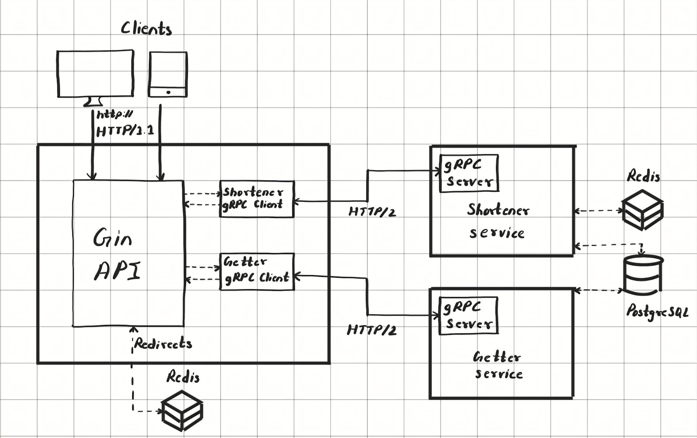

# s7r

A distributed url shortener service built with Go, gRPC and Redis.

The API is protected with JWT based authentication. Users can register and login to access the services.

## Architecture Overview



## API Gateway Documentation

[Postman API Documentation](https://documenter.getpostman.com/view/17001797/2sB34Zs5Lf)

## Shortener gRPC Methods

[shortener.proto file](./shortener_server/proto/shortener.proto)

### `ShortenUrl`

```proto
rpc ShortenUrl(ShortenRequest)returns(ShortenResponse){}
...
message ShortenRequest{
    string url = 1;
    string user_id = 2;
}
message ShortenResponse{
    bool success = 1;
    string short_code = 2;
    string message = 3;
}
```

This methods provides tiny url. It requires the full url and user id.

### `DeleteUrl`

```proto
rpc DeleteUrl(DeleteRequest)returns(DeleteResponse){}
...
message DeleteRequest{
    string short_code = 1;

}
message DeleteResponse{
    bool success = 1;
    string message = 2;
}
```

This method deletes an url by it's short code.

### `RegisterClick`

```proto
rpc RegisterClick(RegisterClickRequest) returns (RegisterClickResponse){}
...
message RegisterClickRequest{
    string short_code = 1;
}
message RegisterClickResponse{
    bool success = 1;
    string message = 2;
}
```

This method increases the click count in PostgreSQL DB.

## Getter gRPC Methods

[getter.proto file](./getter/proto/getter.proto)

### `GetAllUrls`

```proto
rpc GetAllUrls(AllRequest) returns (AllResponse){};
...
message UrlItem{
    string id = 1;
    int64 user_id = 2;
    string url = 3;
    string short = 4;
    int64 clicks = 5;
    google.protobuf.Timestamp created_at = 6;
    google.protobuf.Timestamp updated_at = 7;
}
message AllRequest{
    int64 user_id = 1;
}
message AllResponse{
    bool success = 1;
    string message = 2;
    repeated UrlItem urls = 3;
}
```

This method returns all urls with their data.

### `GetClicks`

```proto
rpc GetClicks (ClickRequest)returns (ClickResponse){};

message ClickRequest{
    string short_code = 1;
}
message ClickResponse{
    bool success = 1;
    string message = 2;
    int64 count = 3;
}
```

This method returns the click count from the short code of the url.

### `GetHistory`

```proto
rpc GetHistory (HistoryRequest) returns (HistoryResponse){};

message HistoryRequest{
    string short_code = 1;
}
message HistoryResponse{
    bool success = 1;
    string message = 2;
    repeated google.protobuf.Timestamp history = 3;
}
```

This method returns the clicked timestamp history of an url using its short code.

## Detailed flow of URLs

### 1. Shortening an URL

1. User calls `/api/v1/create` API by providing the original url.
2. This calls the `ShortenUrl` gRPC method of `shortener` service.
3. This method uses `md5` hash function with regexp to generate a 6 character short code for tiny url.
4. This url with its short code is stored in redis and also inserted to the PostgreSQL DB.
5. Then the short code is returned to user as response.

### 2. Redirecting from Short code

1. User makes a GET API call on `/:short` route.
2. the `short` param is extracted from url, and using it as a key, the original url is fetched from Redis.
3. The redis call is made on `api-gateway` service itself for low latency(no gRPC calls).
4. When successfully redirected from Redis, concurrently a gRPC method `RegisterClick` is called of the `shortener` service to increment url's click count in PostgreSQL DB.

## Requirements

This project requires a Redis and PostgreSQL DB connection.

I have used docker to run containers for both.

Provide the api-gateway's PORT, PostgreSQL DB connection details, Redis connection details, shortener & getter service's target URLs (Here i have provided localhost's URL as all services are running on my machine) in a `.env` file.

```env
API_PORT=8000

PG_USER=postgres
PG_PASS=postgres
PG_HOST=host.docker.internal
PG_PORT=5432
PG_DBNAME=postgres

REDIS_HOST=host.docker.internal
REDIS_PORT=6379

JWT_SECRET=<jwt_secret_string>

SHORTENER_URL=host.docker.internal:5001
GETTER_URL=host.docker.internal:5002
```

## DB Migrations

Run following to create required tables in the PostgreSQL DB.

```bash
migrate -path ./migrations -database "<conn_str>" -verbose up
```

## Run & Deploy with Docker

Run all 3 services of this project using `docker-compose`.

Each service also has their own Dockerfile for building separate images.

```bash
docker-compose --env-file .env -p s7r up -d --build
```

## Future/TODO

- Registering clicks using a message queue(Kafka).
